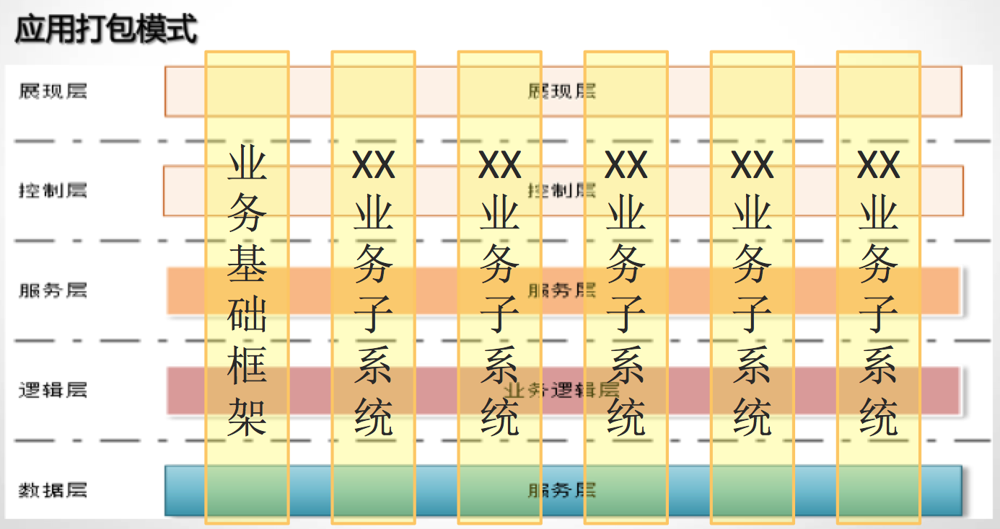
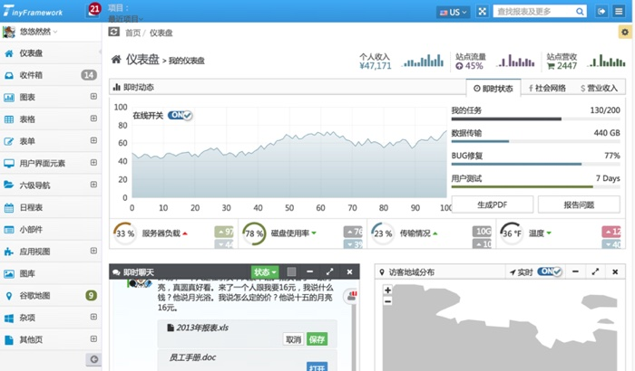
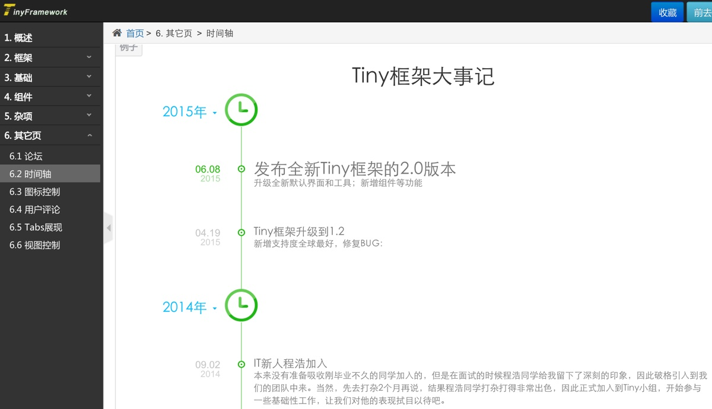
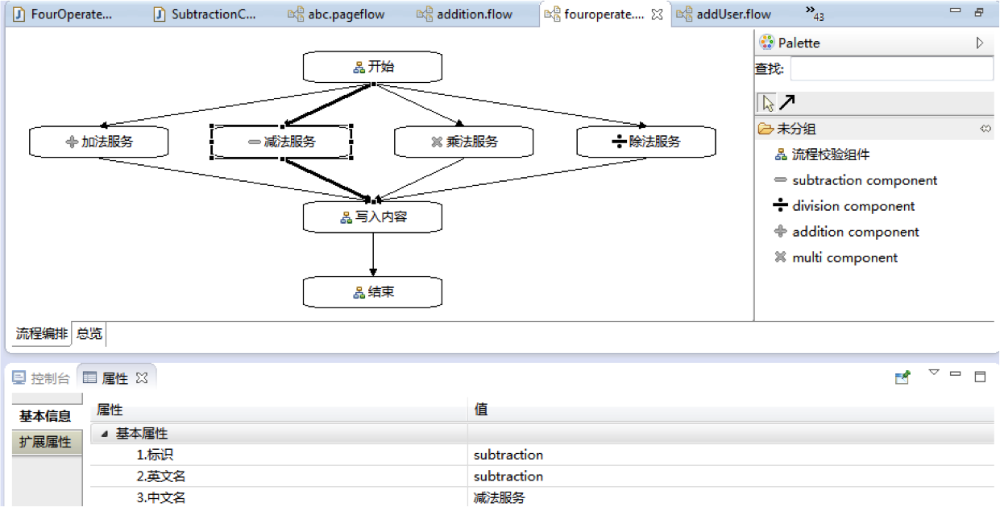
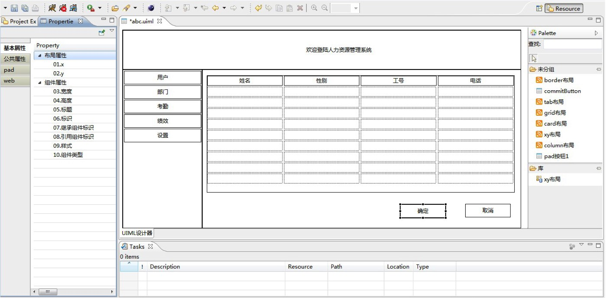

# 框架2.0的设计梳理

**前面从各个角度，讲了大概11篇了。言归正传，这里讲解一个完整的框架设计实例。这里不是一个空白的描述，而是基于V1.0之后的建构。因此，整个设计过程，也会尽量少走一些弯路。一起来看看吧！**

## 方法论
方法论决定了可以达到的高度
方法论，就是人们认识世界、改造世界的根本方法。

它是人们用什么样的方式、方法来观察事物和处理问题。概括地说，世界观主要解决世界“是什么”的问题，方法论主要解决“怎么办”的问题。 

方法论是一种以解决问题为目标的体系或系统，通常涉及对问题阶段、任务、工具、方法技巧的论述。方法论会对一系列具体的方法进行分析研究、系统总结并最终提出较为一般性的原则。 

方法论也是一个哲学概念。人们关于“世界是什么、怎么样”的根本观点是世界观。用这种观点作指导去认识世界和改造世界，就成了方法论。 方法论是普遍适用于各门具体社会科学并起指导作用的范畴、原则、理论、方法和手段的总和。 

Tiny框架有着完整的方法论基础，在方法论的基础上构建了完整的框架构建、扩展、利用体系。

## 设计理念
设计理念决定了设计的目标

使用灵活：可以整个使用它，也可以只用它的一个或几个部分。Tiny构建者认为，一个完整的框架可能需要有许许多多个部分组成，但是对于实际应用的用户来说，它可能只需要其中的一部分功能。构架一定要有这种能力，可以由使用者进行点菜式，使用，避免只要用一点点功能，就要引入许许多多的内容。 

学习成本低、上手容易:框架的学习成本必须非常低，这样才可以让使用者更容易上手，避免由于学习难度大而导致的学习曲线太陡、太长。 

保持核心的稳定性:Tiny框架是立足于在需要稳定、安全要求非常高的应用环境中使用的，因此其稳定性就是框架构建者首要思考目标，核心部分只使用经过充验证及广泛应用的第三方包。 

资产的可积累性：只有易于知识积累，才可以真正做到越用越强。

## 设计原则
设计原则解决目标冲突时的解决策略

约定优于配置原则-COC 

不要重复你自己原则-DRY 

减法原则 :减法原则是我们自己提出的，意思就是给程序员做减法。
模块化原则 :模块化对于软件开发过程中开发、高度、集成、发布、维护过程中所起的作用及节省或花费的巨大成本。因此提出了Business Unit的概念，使得与模块相关的所有内容都可以放在一起。

自动组装原则 :在整个Tiny框架的构建过程中，都非常注重集成过程的自动组装，要求做到扔进去不用管，由框架自动集成。

下级服从上级原则 :Tiny框架则从框架层级做了限制，使得下级必须服务上级。

单一原则 :通过单一原则进行强制性的约束，使得一个模块只解决单一模块应该解决的问题，从而避免不同的问题放在一起解决所导致的胡子眉毛缕不清的问题，同时也避免了不恰当的依赖及模板引用。
集中配置原则 ：在Tiny框架我们对配置做了大量的工作，一个是COC方式，如果不配，则采用系统默认的值；一个是集中原则：把需要人工需要配置的内容都集中起来统一配置；一个是对于不需要人工干预的配置，那就集成在Jar包中，作为发布者发布项的一部分。

## 生态圈
生态圈决定了是否可以持续性发展
只有形成完整的开源生态圈，开源才能生存、发展。 

只有输出没有输入的模式不可能得到持续发展。 

Tiny开源生态圈，包含了Tiny框架、Tiny开源组件、Tiny商业组件、Tiny技术支持、Tiny咨询、Tiny培训等，具有较强市场竞争力和可持续发展的体系，展现了一种新的软件产业发展模式。 

不管您处在生态圈的哪个位置，您都会有所付出有所收获，这正是生态圈的意义及可持续发展的动力所在。

## 模块化
模块化能力决定了业务模块治理的优劣
Tiny框架在模块化方面进行了深入的研究和实践。 

Tiny业务开发过程中的任何内容都可以放入Jar包当中去，包含Java类，静态资源，JSP等等，所以一个业务模块是不是被工程引用，只要引入对应的Jar包，就可以引入此业务模块；只要把某个业务模块的Jar包移除就可以彻底移除此业务模块。 

Tiny框架的业务单元具有非常好的独立性、替换性和通用性。 



## 热部署
热部署可有效帮助提升系统的可用性
所谓热部署，就是在应用正在运行的时候软件升级，却不需要重新启动应用。 

常见的热部署方案有OSGI等框架，但是这些方案具有侵入性大，开发调试困难，使用方式固定等弊端。 

Tiny框架的Bundle与普通的Jar工程没有本质区别，仅多了一个配置文件。所以，它即可以作为普通的Jar包使用也可以作为热部署的Bundle来进行使用。

## 流程引擎
流程引擎提供了非编程性开发的能力
所谓流程引擎，就是对通过流程化的方式来进行业务、页面、工作流程的编排支持的开发框架。

Tiny框架提供了业务流、页面流、工作流(正在实现中)等三种流程编排引擎，可以方便的进行业务流、页面流、工作流领域的开发。

强大的可视化流程设计工具，可以便捷的进行流程设计。

## WEB展现
WEB展现是互联网应用中重中之重
Web应用开发是J2EE领域的重要问题领域

Tiny框架提供了强大的WEB层的扩展和UI组件支持,对于WEB静态资源放入Jar包，CSS合并压缩、JS合并压缩等方面都有良好支持。对于不同角色的开发者之也可以进行良好角色划分，使得开发过程更加高效有序。


领先的模板引擎提供的一些独特特性使得可以更便捷的进行展现层开发。 





## 组件库
面向组件的开发是效率与质量的保证
组件化编程的关键目的是为了将程序模块化，使各个模块之间可以单独开发，单独测试。组件的提取、管理与利用是面向组件开发的关键。 

Tiny框架中，组件无处不在，有些组件框架中已经默认嵌入，有些组件就需要自己手工纳入。当然，一些愿分享组件的同学也可以发布自己的组件让别人使用。

组件化有助于推动企业资产的积累与高水平开发人员工作成果的复用，这个在现在这个讲究协作的竞争体系中尤为重要。

```
1  ├── org.tinygroup.jquery必须使用的jquery包
2  ├── org.tinygroup.publicComponentTinyUi特有资源（基础-必须依赖基于bootstrap）
3  ├── /webapp/compatibility(特殊)compatibility针对各浏览器兼容性特有资源
4  ├── org.tinygroup.bootstrap使用bootstrap最新v3.3.4
5  ├── org.tinygroup.gridSystems栅格系统（布局）
6  ├── org.tinygroup.compose排版（一般都能用到）
7  ├── org.tinygroup.code代码
8  ├── org.tinygroup.table表格
9  ├── org.tinygroup.form表单
10 ├── org.tinygroup.button按钮
11 ├── org.tinygroup.picture图片
12 ├── org.tinygroup.icon图标
13 ├── org.tinygroup.animation动画
14 ├── org.tinygroup.buttonGroup按钮组
15 ├── org.tinygroup.navigation导航
16 ├── org.tinygroup.dropDown下拉菜单
17 ├── org.tinygroup.unslider幻灯片
18 ├── org.tinygroup.tab选项卡
19 ├── org.tinygroup.labelBadge便签与标号
20 ├── org.tinygroup.thumbnails缩略图
21 ├── org.tinygroup.alert警告
22 ├── org.tinygroup.progress进度条
23 ├── org.tinygroup.modal弹出框
24 ├── org.tinygroup.customerService客服
25 ├── org.tinygroup.toTop返回顶部
26 ├── org.tinygroup.example案例
27 ├── org.tinygroup.rolling滚动
28 ├── org.tinygroup.search搜索
29 ├── org.tinygroup.ad广告
30 ├── org.tinygroup.tags标签
31 ├── org.tinygroup.fold折叠
32 ├── org.tinygroup.maskBar遮罩
33 ├── org.tinygroup.comment评论列表
34 ├── org.tinygroup.syntaxhighlighter代码高亮
35 ├── org.tinygroup.dataTablesDataTables数据表格
36 ├── org.tinygroup.mmGridmmGrid数据表格
37 ├── org.tinygroup.superBoxsuperBox图片列表
38 ├── org.tinygroup.zoomPiczoomPic图片列表
39 ├── org.tinygroup.Smart-navigation导航集合
40 ├── org.tinygroup.Smart-treeview树形菜单
41 ├── org.tinygroup.highChartshighCharts图表
42 ├── org.tinygroup.voteCharts投票图表
43 ├── org.tinygroup.pieCharts饼状图比例分布图
44 ├── org.tinygroup.bootstrapDate日期控件
45 ├── org.tinygroup.uedTipsUED提示
46 ├── org.tinygroup.loginRegistered登录注册
47 ├── org.tinygroup.trumbowygTrumbowyg编辑器
48 ├── org.tinygroup.UEditorUEditor编辑器
49 ├── org.tinygroup.fullCalendarfullCalendar日程表 
50 ├── org.tinygroup.emailTemplate邮件模版
51 ├── org.tinygroup.error404错误404
52 ├── org.tinygroup.error500错误500
53 ├── org.tinygroup.searchPage搜索页
54 ├── org.tinygroup.interfaceElements界面元素
55 ├── org.tinygroup.forum论坛页
56 ├── org.tinygroup.timeline时间轴
57 ├── org.tinygroup.iconTab图标控制选项卡
58 ├── org.tinygroup.userComment用户评论
59 ├── org.tinygroup.tabShowTabs展示
60 ├── org.tinygroup.viewsControl视图控制
```


## 开发工具
开发工具是软件工程方法的延伸
不用Tiny开发工具你可以完成所有基于Tiny框架的开发工作。

用了Tiny开发工具你可以更快的完成基于Tiny框架的开发工作，效率提升5倍不是想象。

这，就是开发工具的意义。 


模板语言编辑器   
流程编辑器


 
可视化界面编辑器



还有许多不再一一贴图。