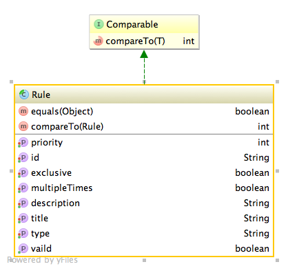
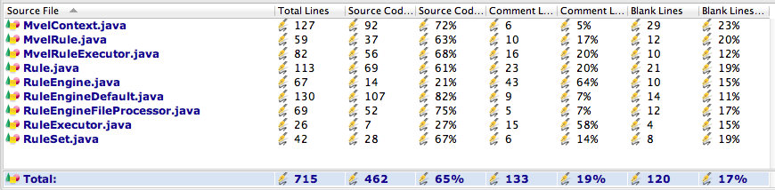

# 量身定制规则引擎，适应多变业务场景

规则引擎适合于做业务规则频繁变化的场景，我们的业务在应用过程中，也经常要处理大量的业务规则，当然，也希望能有一套规则引擎来支撑，这样是再好不过的。
对一些常用的商业规则引擎做一下了解，感觉非常不错，但是太贵了。看一些开源的引擎吧，也不错，但是感觉相对于我们自己这么简单的需求，太复杂了。

于是就想着自己做个，试试看能不能解决了自己的这些简单的业务规则频繁变化的业务场景，嗯嗯，脑子里大概过了一下电影，感觉路是通的，主要有如下业务需求：

- 业务规则执行器需要支持多种，也应该支持业务人员自行扩展，原因是我自己设计的业务规则再完美，也不可能完美的适应所有人的胃口，所以这个默认可以有支持的，但是一定是可以扩展的
- 业务规则要支持优先级，也就是说有的业务规则先执行，有的业务规则后执行
- 业务规则允许排他规则，也就是说只要执行到排他规则，就可以马上结束
- 业务规则可以允许重复执行，这样才可以方便的进行循环处理
- 在规则引擎中，可以方便的使用Spring中的业务对象
于是就可以开始设计了：

## 规则执行器接口

由于业务规则执行器需要支持扩展，当然需要设计一个接口了：

```
<span style="font-size:14px;">/** 
 * 规则执行器，可以有多种实现 
 */  
public interface RuleExecutor<T extends Rule> {  
    /** 
     * 返回执行器类型 
     * 
     * @return 
     */  
    String getType();  
   
    /** 
     * 执行规则，并把结果放到上下文上 
     * 
     * @param context 
     * @return 返回条件是否成立 
     */  
    boolean execute(Context context, T rule);  
}  
</span>  
```

一共就两方法，getType用来返回规则执行器的类型，以确定它是解决哪种类型的规则的。  execute方法用来执行规则，执行的结果是一个布尔值，表示此条规则是否有执行。

 
## 规则引擎接口

接下来就是设计规则引擎的接口了：

```
<span style="font-size:14px;">public interface RuleEngine {  
     /** 
      * 对指定上下文执行指定类型的规则 
     * 
      * @param context 
      * @param ruleSetName 
      */  
     void execute(Context context, String ruleSetName);  
  
     /** 
      * 添加一组规则 
     * 
      * @param ruleSet 
      */  
     void addRules(RuleSet ruleSet);  
  
     /** 
      * 删除一组规则 
     * 
      * @param ruleSet 
      */  
     void removeRules(RuleSet ruleSet);  
  
     /** 
      * 添加规则执行器列表 
     * 
      * @param ruleExecutors 
      */  
     void addRuleExecutors(List<RuleExecutor> ruleExecutors);  
  
     /** 
      * 添加一个规则执行器 
     * 
      * @param ruleExecutor 
      */  
     void addRuleExecutor(RuleExecutor ruleExecutor);  
        
     /** 
      * 删除规则执行器列表 
     * 
      * @param ruleExecutors 
      */  
     void removeRuleExecutors(List<RuleExecutor> ruleExecutors);  
  
     /** 
      * 删除一个规则执行器 
     * 
      * @param ruleExecutor 
      */  
     void removeRuleExecutor(RuleExecutor ruleExecutor);  
        
     /** 
      * 设置一批规则执行器 
     * @param ruleExecutors 
      */  
     void setRuleExecutors(List<RuleExecutor> ruleExecutors);  
 }  
</span>  
```

如上面的代码一样，还是非常简单的。  execute用来执行一个规则集，其它的方法就是对规则集和规则执行器的管理，只要看一遍就一清二楚了。 


## 规则集对象

```
<span style="font-size:14px;">@XStreamAlias("rule-set")  
 public class RuleSet {  
     /** 
      * 同种名称的规则集会自动合并 
     */  
     @XStreamAsAttribute  
     private String name;  
        
     @XStreamImplicit  
     private List<Rule> rules;  
  
     public String getName() {  
         return name;  
     }  
  
     public void setName(String name) {  
         this.name = name;  
     }  
  
     public List<Rule> getRules() {  
         if(rules==null){  
             rules = new ArrayList<Rule>();  
         }  
         return rules;  
     }  
  
     public void setRules(List<Rule> rules) {  
         this.rules = rules;  
     }  
 }  
</span>  
```

规则集就两属性，一个属性是规则集的名称，另外一个属性就是一组规则。规则集的名称用来表示一组相关的业务规则。 

## 规则抽象类

根据上面的业务需求，抽象类Rule的结构如下：



它里面只有基本的几个属性：优先级，标识，是否排他，是否允许重复，描述，标题，类型，有效性。 
说好的业务规则呢，怎么描述？
 
由于不同的规则执行器，它可以支持的规则也不一样，因此这里的规则抽象类只有基本的一些属性，怎么样描述规则由其子类决定。 

MVEL方式的规则及其执行器  Mvel规则

```
<span style="font-size:14px;">/** 
 * 采用MVEL表达式作为条件实现 
* @author yancheng11334 
 * 
 */  
 @XStreamAlias("mvel-rule")  
 public class MvelRule extends Rule{  
     //匹配条件  
    private String condition;  
     //后续操作  
    private String action;  
     
     public String getCondition() {  
         return condition;  
     }  
  
     public void setCondition(String condition) {  
         this.condition = condition;  
     }  
        
     public String getAction() {  
         return action;  
     }  
  
     public void setAction(String action) {  
         this.action = action;  
     }  
  
     public String getType(){  
         return "mvel";  
     }  
  
     public String toString() {  
         return "MvelRule [condition=" + condition + ", action=" + action  
                 + ", type=" + getType() + ", id=" + getId() + ", priority="+ getPriority() +", multipleTimes="+isMultipleTimes()+",exclusive="+isExclusive()+"]";  
     }  
  
     /** 
      * 验证mvel规则的合法性 
     */  
     public boolean isVaild() {  
         if(StringUtil.isEmpty(getCondition())){  
             throw new RuntimeException(String.format("规则[%s]的匹配条件为空", getId()));  
         }  
         if(StringUtil.isEmpty(getAction())){  
             throw new RuntimeException(String.format("规则[%s]的后续操作为空", getId()));  
         }  
         return true;  
     }  
 }  
</span>  
```

上面表示，这个规则的类型都是mvel，这个规则包含了两个属性：condition和action，condition表示条件，只有条件执行结果为真的时候，才执行action中的处理。 

## Mvel规则执行器

```
<span style="font-size:14px;">public class MvelRuleExecutor implements RuleExecutor<MvelRule>{  
  
     private EL el;  
        
     public EL getEl() {  
         return el;  
     }  
  
     public void setEl(EL el) {  
         this.el = el;  
     }  
  
     public String getType() {  
         return "mvel";  
     }  
  
     public boolean execute(Context context, MvelRule rule) {  
         try{  
             if(executeCondition(rule.getCondition(),context)){  
                 executeAction(rule.getAction(),context);  
                 return true;  
             }else{  
                 return false;  
             }  
         }catch(RuntimeException e){  
            throw e;  
         }catch(Exception e){  
            throw new RuntimeException("Mvel规则引擎执行器发生异常:",e);  
         }  
     }  
        
     /** 
      * 判断条件是否匹配 
     * @param condition 
      * @param context 
      * @return 
      */  
     protected boolean executeCondition(String condition,Context context){  
         try{  
             MvelContext mvelContext=null;  
             if(context instanceof MvelContext){  
                 mvelContext=(MvelContext) context;  
             }else{  
                 mvelContext=new MvelContext(context);  
             }  
             return (Boolean)el.execute(condition, mvelContext);  
         }catch(Exception e){  
            throw new RuntimeException(String.format("条件[%s]匹配发生异常:", condition),e);  
         }  
     }  
        
     /** 
      * 执行条件匹配后的操作 
     * @param action 
      * @param context 
      */  
     protected void executeAction(String action,Context context) {  
         try {  
             MvelContext mvelContext = null;  
             if (context instanceof MvelContext) {  
                 mvelContext = (MvelContext) context;  
             } else {  
                 mvelContext = new MvelContext(context);  
             }  
  
             el.execute(action, mvelContext);  
         } catch (Exception e) {  
             throw new RuntimeException(String.format("后续操作[%s]执行发生异常:", action), e);  
         }  
     }  
 }  
</span>  
```

execute方法的意思是：如果执行条件表达式且返回真，那么就执行action中的处理，并返回true，否则就返回false。   呵呵，这个逻辑也太简单了。对，tiny框架的一大特点就是用非常简单的逻辑来实现相对复杂的处理。


## Mvel上下文

前面讲到，要方便的在表达式中调用Spring中托管的对象，这个的实现就要从上下文上作文章了：

```
<span style="font-size:14px;">public <T> T get(String name) {  
         if(context.exist(name)){  
            return (T)context.get(name);  
         }else{  
            //必须保存到上下文，否则每次返回不一定是同一个对象(scope可能是属性)  
            T t = (T)beanContainer.getBean(name);  
            context.put(name, t);  
            return t;  
         }  
     }  
</span>  
```

主要的逻辑在上面，也就是说：如果上下文中有对像，那么就从上下文中取；如果没有，那么就从Spring容器中取。呵呵，这么高大上的功能，实现起来也这么简单。

## 规则引擎实现类

到上面为止，相关的准备工作都就绪了，规则引擎的实现类也可以现身了。其实这个类不贴吧，看文章的同学们一定说我藏着掖着，但是贴出来吧，真的没有啥技术含量： 

```
<span style="font-size:14px;">public class RuleEngineDefault implements RuleEngine {  
     private Map<String, List<Rule>> ruleSetMap = new ConcurrentHashMap<String, List<Rule>>();  
     private List<RuleExecutor> ruleExecutors = null;  
     private Map<String, RuleExecutor> ruleExecutorMap = new ConcurrentHashMap<String, RuleExecutor>();  
        
     protected static Logger logger = LoggerFactory  
     .getLogger(RuleEngineDefault.class);  
        
     public void execute(Context context, String ruleSetName) {  
         List<Rule> ruleSet = ruleSetMap.get(ruleSetName);  
         if (ruleSet != null) {  
             Vector<Rule> newSet = new Vector<Rule>(ruleSet);  
             processRuleSet(context, newSet);  
         }  
     }  
  
     private void processRuleSet(Context context, Vector<Rule> newSet) {  
         //如果没有后续规则，则退出  
        if (newSet.size() == 0) {  
             return;  
         }  
         Rule rule = newSet.get(0);  
         RuleExecutor ruleExecutor = ruleExecutorMap.get(rule.getType());  
         if (ruleExecutor != null) {  
             boolean executed = ruleExecutor.execute(context, rule);  
             if (executed) {  
                 //如果  
                if (rule.isExclusive()) {  
                     //如果条件成立，则是独占条件，则直接返回  
                    return;  
                 } else if (!rule.isMultipleTimes()) {  
                     //如果不是可重复执行的规则，则删除之  
                    newSet.remove(0);  
                 }  
             } else {  
                 //如果不匹配，则删除之  
                newSet.remove(0);  
             }  
         } else {  
             throw new RuntimeException("找不到对应" + rule.getType() + "的执行器");  
         }  
         processRuleSet(context, newSet);  
     }  
  
     public void addRules(RuleSet ruleSet) {  
         List<Rule> rules = ruleSetMap.get(ruleSet.getName());  
         if (rules == null) {  
             rules = new Vector<Rule>();  
             ruleSetMap.put(ruleSet.getName(), rules);  
         }  
         //检查规则  
        for(Rule rule:ruleSet.getRules()){  
             if(rule.isVaild()){  
                 rules.add(rule);  
             }else{  
                 logger.logMessage(LogLevel.ERROR, String.format("规则[%s]检查无效.", rule.getId()));  
             }  
             rule.isVaild();  
         }  
         Collections.sort(rules);  
     }  
        
  
     public void removeRules(RuleSet ruleSet) {  
         List<Rule> rules = ruleSetMap.get(ruleSet.getName());  
         if (rules != null) {  
             rules.removeAll(ruleSet.getRules());  
         }  
     }  
  
     public void setRuleExecutors(List<RuleExecutor> ruleExecutors) {  
         this.ruleExecutors = ruleExecutors;  
         for (RuleExecutor ruleExecutor : ruleExecutors) {  
             ruleExecutorMap.put(ruleExecutor.getType(), ruleExecutor);  
         }  
     }  
  
     public void addRuleExecutor(RuleExecutor ruleExecutor) {  
         if (ruleExecutors == null) {  
             ruleExecutors = new ArrayList<RuleExecutor>();  
         }  
         ruleExecutors.add(ruleExecutor);  
         ruleExecutorMap.put(ruleExecutor.getType(), ruleExecutor);  
     }  
  
     public void addRuleExecutors(List<RuleExecutor> ruleExecutors) {  
         if(ruleExecutors!=null){  
            for(RuleExecutor ruleExecutor:ruleExecutors){  
                addRuleExecutor(ruleExecutor);  
            }  
         }  
     }  
  
     public void removeRuleExecutors(List<RuleExecutor> ruleExecutors) {  
         if(ruleExecutors!=null){  
            for(RuleExecutor ruleExecutor:ruleExecutors){  
                removeRuleExecutor(ruleExecutor);  
            }  
         }  
     }  
  
     public void removeRuleExecutor(RuleExecutor ruleExecutor) {  
         if (ruleExecutors == null) {  
             ruleExecutors = new ArrayList<RuleExecutor>();  
         }  
         ruleExecutors.remove(ruleExecutor);  
         ruleExecutorMap.remove(ruleExecutor.getType());  
     }  
 }  
</span>  
```

一大堆维护规则和规则执行器的代码就不讲了，关键的几个讲下：

```
<span style="font-size:14px;">public void execute(Context context, String ruleSetName) {  
         List<Rule> ruleSet = ruleSetMap.get(ruleSetName);  
         if (ruleSet != null) {  
             Vector<Rule> newSet = new Vector<Rule>(ruleSet);  
             processRuleSet(context, newSet);  
         }  
     }  
</span>  
```

查找规则集，如果能找到就执行规则集，否则啥也不干。

```
<span style="font-size:14px;">private void processRuleSet(Context context, Vector<Rule> newSet) {  
         //如果没有后续规则，则退出  
        if (newSet.size() == 0) {  
             return;  
         }  
         Rule rule = newSet.get(0);  
         RuleExecutor ruleExecutor = ruleExecutorMap.get(rule.getType());  
         if (ruleExecutor != null) {  
             boolean executed = ruleExecutor.execute(context, rule);  
             if (executed) {  
                 //如果  
                if (rule.isExclusive()) {  
                     //如果条件成立，则是独占条件，则直接返回  
                    return;  
                 } else if (!rule.isMultipleTimes()) {  
                     //如果不是可重复执行的规则，则删除之  
                    newSet.remove(0);  
                 }  
             } else {  
                 //如果不匹配，则删除之  
                newSet.remove(0);  
             }  
         } else {  
             throw new RuntimeException("找不到对应" + rule.getType() + "的执行器");  
         }  
         processRuleSet(context, newSet);  
     }  
</span>  
```

执行规则集的逻辑是：   如果规则集合中没有规则了，表示规则集已经执行完毕，直接返回。否则获取优先级最高的规则，首先检查是否有对象的规则执行器，如果没有，则抛异常。如果有就开始执行。 
如果执行返回true，说明此规则被成功执行，则判断其是否是排他规则，如果是，则返回；否则检查是否是可重复执行规则，如果是则返回继续执行，否则把此条规则删除，继续执行下一条规则。 

## 示例

这里假定做一个计算个人所得税的规则实例 

**定义规则**

```
<span style="font-size:14px;"><rule-set name="feerule" >  
      <!-- 独占类条件(执行顺序交互不影响执行结果) -->  
      <!--优先级,数值越小优先级越高，用户设置优先级必须大于0;如果没有设置，系统会随机分配一个优先级;同一个规则集不能出现两个相同优先级的规则-->  
      <mvel-rule id="step1"  multipleTimes="false" exclusive="true">  
         <condition><![CDATA[salary<=3500]]></condition>  
         <action><![CDATA[fee=0]]></action>  
      </mvel-rule>  
      <mvel-rule id="step2"  multipleTimes="false" exclusive="true">  
         <condition><![CDATA[salary>3500 && salary<=5000]]></condition>  
         <action><![CDATA[fee=(salary-3500)*0.03]]></action>  
      </mvel-rule>  
      <mvel-rule id="step3"  multipleTimes="false" exclusive="true">  
         <condition><![CDATA[salary>5000 && salary<=8000]]></condition>  
         <action><![CDATA[fee=(salary-3500)*0.1-105]]></action>  
      </mvel-rule>  
      <mvel-rule id="step4"  multipleTimes="false" exclusive="true">  
         <condition><![CDATA[salary>8000 && salary<=12500]]></condition>  
         <action><![CDATA[fee=(salary-3500)*0.2-555]]></action>  
      </mvel-rule>  
      <mvel-rule id="step5" multipleTimes="false" exclusive="true">  
         <condition><![CDATA[salary>12500 && salary<=38500]]></condition>  
         <action><![CDATA[fee=(salary-3500)*0.25-1005]]></action>  
      </mvel-rule>  
      <mvel-rule id="step6"  multipleTimes="false" exclusive="true">  
         <condition><![CDATA[salary>38500 && salary<=58500]]></condition>  
         <action><![CDATA[fee=(salary-3500)*0.3-2755]]></action>  
      </mvel-rule>  
      <mvel-rule id="step7"  multipleTimes="false" exclusive="true">  
         <condition><![CDATA[salary>58500 && salary<=83500]]></condition>  
         <action><![CDATA[fee=(salary-3500)*0.35-5505]]></action>  
      </mvel-rule>  
      <mvel-rule id="step8"  multipleTimes="false" exclusive="true">  
         <condition><![CDATA[salary>83500]]></condition>  
         <action><![CDATA[fee=(salary-3500)*0.45-13505]]></action>  
      </mvel-rule>  
   </rule-set>  
</span>  
```

编写TestCase

```
<span style="font-size:14px;">public void testFeeRule(){  
         Context context = new MvelContext();  
         context.put("fee", 0.0);  
            
         context.put("salary", 1000);  
         ruleEngine.execute(context, "feerule");  
         assertEquals(0, context.get("fee"));  
            
         context.put("salary", 4000);  
         ruleEngine.execute(context, "feerule");  
         assertEquals(15.0, context.get("fee"));  
            
         context.put("salary", 7000);  
         ruleEngine.execute(context, "feerule");  
         assertEquals(245.0, context.get("fee"));  
            
         context.put("salary", 21000);  
         ruleEngine.execute(context, "feerule");  
         assertEquals(3370.0, context.get("fee"));  
            
         context.put("salary", 40005);  
         ruleEngine.execute(context, "feerule");  
         assertEquals(8196.50, context.get("fee"));  
            
         context.put("salary", 70005);  
         ruleEngine.execute(context, "feerule");  
         assertEquals(17771.75, context.get("fee"));  
            
         context.put("salary", 100000);  
         ruleEngine.execute(context, "feerule");  
         assertEquals(29920.00, context.get("fee"));  
     }  
</span>  
```

看到这里的时候，我唯一的想法是：啥时我才可以一个月缴3万块的税呀。    总结 呵呵，按照Tiny惯例，传上代码统计数据： 



至此，一个简单的规则引擎就实现了，总共代码行数不包含注释为：462行。可以较好的适应各种简单的业务逻辑频繁变化的业务场景。