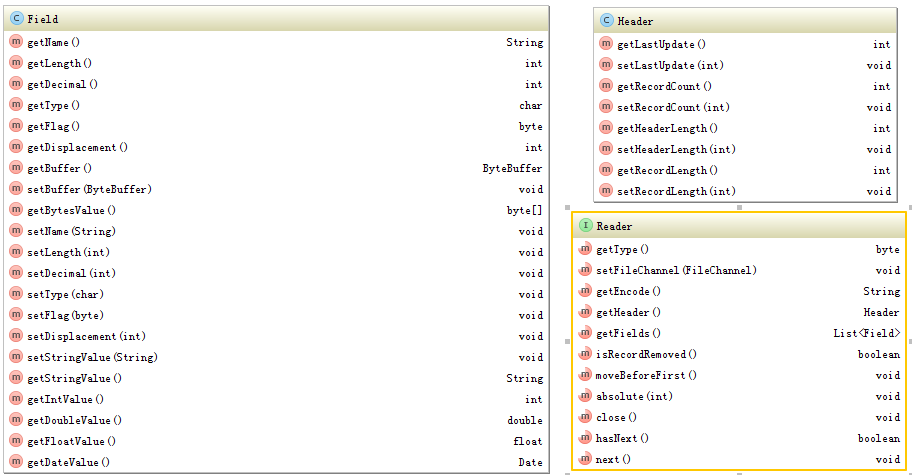
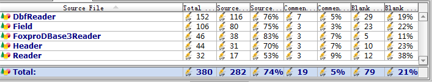

# 用200行的DBF解析器来展示良好架构设计

由于工作关系，需要工作当中，需要读取DBF文件，找了一些DBF读取开源软件，要么是太过庞大，动不动就上万行，要么是功能有问题，编码，长度，总之是没有找到一个非常爽的。在万般无奈之下，我老人家怒从心头起，恶向胆边生，决定自己写一下。结果只用了不到300行代码就搞定了，当然搞定不是唯一目标，还要优雅简洁的搞定，亲们跟随我的脚步一起感受一下简洁的设计与实现吧。 

在开始编码之前，先介绍一下DBF，这个DBF可是个老东西，在DOS时代就已经出现，并且风骚了相当一段时间，后来随着大型数据库的应用，它逐步没落，但是由于其简洁易用的特点，还是应用在大量的数据交换当中。但是其发展过程中，也形成了许多种版本，不同版本的结构不一样，也就决定 了其解析程序也是不一样的。 

今天我只实现了Foxbase/DBaseIII的解析，但是也为扩展各种其它版本做好了准备。 



> 接口设计 

上面一共就两个类，一个接口，Field和Header就是两个简单的POJO类，分别定义了文件头及字段相关的信息。 
Reader接口是DBF文件读取的接口，主要定义了获取文件类型，编码，字段以及记录移动相关的方法。 
代码实现 首先实现Reader的抽象类

 
```
public abstract class DbfReader implements Reader {  
     protected String encode = "GBK";  
     private FileChannel fileChannel;  
     protected Header header;  
     protected List<Field> fields;  
     private boolean recordRemoved;  
     int position = 0;  
     static Map<Integer, Class> readerMap = new HashMap<Integer, Class>();  
   
    static {  
         addReader(3, FoxproDBase3Reader.class);  
     }  
   
    public static void addReader(int type, Class clazz) {  
         readerMap.put(type, clazz);  
     }  
   
    public static void addReader(int type, String className) throws ClassNotFoundException {  
         readerMap.put(type, Class.forName(className));  
     }  
   
    public byte getType() {  
         return 3;  
     }  
   
    public String getEncode() {  
         return encode;  
     }  
   
    public Header getHeader() {  
         return header;  
     }  
   
    public List<Field> getFields() {  
         return fields;  
     }  
   
  
    public boolean isRecordRemoved() {  
         return recordRemoved;  
     }  
   
    public static Reader parse(String dbfFile, String encode) throws IOException, IllegalAccessException, InstantiationException {  
         return parse(new File(dbfFile), encode);  
     }  
   
    public static Reader parse(String dbfFile) throws IOException, IllegalAccessException, InstantiationException {  
         return parse(new File(dbfFile), "GBK");  
     }  
   
    public static Reader parse(File dbfFile) throws IOException, IllegalAccessException, InstantiationException {  
         return parse(dbfFile, "GBK");  
     }  
   
    public static Reader parse(File dbfFile, String encode) throws IOException, IllegalAccessException, InstantiationException {  
         RandomAccessFile aFile = new RandomAccessFile(dbfFile, "r");  
         FileChannel fileChannel = aFile.getChannel();  
         ByteBuffer byteBuffer = ByteBuffer.allocate(1);  
         fileChannel.read(byteBuffer);  
         byte type = byteBuffer.array()[0];  
         Class<Reader> readerClass = readerMap.get((int) type);  
         if (readerClass == null) {  
             fileChannel.close();  
             throw new IOException("不支持的文件类型[" + type + "]。");  
         }  
         DbfReader reader = (DbfReader) readerClass.newInstance();  
         reader.setFileChannel(fileChannel);  
         reader.readHeader();  
         reader.readFields();  
         return reader;  
     }  
   
    public void setFileChannel(FileChannel fileChannel) {  
         this.fileChannel = fileChannel;  
     }  
   
  
    protected abstract void readFields() throws IOException;  
   
    public void moveBeforeFirst() throws IOException {  
         position = 0;  
         fileChannel.position(header.getHeaderLength());  
     }  
   
    /**  
      * @param position 从1开始  
      * @throws java.io.IOException  
      */  
     public void absolute(int position) throws IOException {  
         checkPosition(position);  
         this.position = position;  
         fileChannel.position(header.getHeaderLength() + (position - 1) * header.getRecordLength());  
     }  
   
    private void checkPosition(int position) throws IOException {  
         if (position >= header.getRecordCount()) {  
             throw new IOException("期望记录行数为" + (this.position + 1) + "，超过实际记录行数：" + header.getRecordCount() + "。");  
         }  
     }  
   
    protected abstract Field readField() throws IOException;  
   
    protected abstract void readHeader() throws IOException;  
   
  
    private void skipHeaderTerminator() throws IOException {  
         ByteBuffer byteBuffer = ByteBuffer.allocate(1);  
         readByteBuffer(byteBuffer);  
     }  
   
    public void close() throws IOException {  
         fileChannel.close();  
     }  
   
    public void next() throws IOException {  
         checkPosition(position);  
         ByteBuffer byteBuffer = ByteBuffer.allocate(1);  
         readByteBuffer(byteBuffer);  
         this.recordRemoved = (byteBuffer.array()[0] == '*');  
         for (Field field : fields) {  
             read(field);  
         }  
         position++;  
     }  
   
    public boolean hasNext() {  
         return position < header.getRecordCount();  
     }  
   
    private void read(Field field) throws IOException {  
         ByteBuffer buffer = ByteBuffer.allocate(field.getLength());  
         readByteBuffer(buffer);  
         field.setStringValue(new String(buffer.array(), encode).trim());  
         field.setBuffer(buffer);  
     }  
   
    protected void readByteBuffer(ByteBuffer byteBuffer) throws IOException {  
         fileChannel.read(byteBuffer);  
     }  
 }  
```

这个类是最大的一个类，值得注意的是几个静态方法：  addReader和parse， addReader用于增加新的类型的Reader，parse用于解析文件。 

parse的执行过程是首先读取第一个字节，判断是否有对应的解析实现类，如果有，就有对应的解析实现类去解析，如果没有，则抛出错误声明不支持。 

下面写实现类就简单了，下面是FoxproDBase3的解析器： 

```
public class FoxproDBase3Reader extends DbfReader {  
    protected void readFields() throws IOException {  
        fields = new ArrayList<Field>();  
        for (int i = 0; i < (header.getHeaderLength() - 32 - 1) / 32; i++) {  
            fields.add(readField());  
        }  
    }  
  
    public byte getType() {  
        return 3;  
    }  
  
    protected Field readField() throws IOException {  
        Field field = new Field();  
        ByteBuffer byteBuffer = ByteBuffer.allocate(32);  
        readByteBuffer(byteBuffer);  
        byte[] bytes = byteBuffer.array();  
        field.setName(new String(bytes, 0, 11, encode).trim().split("\0")[0]);  
        field.setType((char) bytes[11]);  
        field.setDisplacement(Util.getUnsignedInt(bytes, 12, 4));  
        field.setLength(Util.getUnsignedInt(bytes, 16, 1));  
        field.setDecimal(Util.getUnsignedInt(bytes, 17, 1));  
        field.setFlag(bytes[18]);  
        return field;  
    }  
  
    protected void readHeader() throws IOException {  
        header = new Header();  
        ByteBuffer byteBuffer = ByteBuffer.allocate(31);  
        readByteBuffer(byteBuffer);  
        byte[] bytes = byteBuffer.array();  
        header.setLastUpdate((Util.getUnsignedInt(bytes, 0, 1) + 1900) * 10000 + Util.getUnsignedInt(bytes, 1, 1) * 100 + Util.getUnsignedInt(bytes, 2, 1));  
        header.setRecordCount(Util.getUnsignedInt(bytes, 3, 4));  
        header.setHeaderLength(Util.getUnsignedInt(bytes, 7, 2));  
        header.setRecordLength(Util.getUnsignedInt(bytes, 9, 2));  
    }  
}  
```


测试用例  

```
public class DbfReaderTest {  
    static String[] files = {"BESTIMATE20140401", "BHDQUOTE20140401"};  
  
    public static void main(String[] args) throws IOException, IllegalAccessException, InstantiationException {  
        for (String file : files) {  
            printFile(file);  
        }  
    }  
  
    public static void printFile(String fileName) throws IOException, InstantiationException, IllegalAccessException {  
        Reader dbfReader = DbfReader.parse("E:\\20140401\\" + fileName + ".DBF");  
        for (Field field : dbfReader.getFields()) {  
            System.out.printf("name:%s %s(%d,%d)\n", field.getName(), field.getType(), field.getLength(), field.getDecimal());  
        }  
        System.out.println();  
        for (int i = 0; i < dbfReader.getHeader().getRecordCount(); i++) {  
            dbfReader.next();  
            for (Field field : dbfReader.getFields()) {  
                System.out.printf("%" + field.getLength() + "s", field.getStringValue());  
            }  
            System.out.println();  
        }  
        dbfReader.close();  
  
    }  
}  
```

可以看到最后的使用也是非常简洁的。 
代码统计

 

总共的代码行数是282行，去掉import和接口声明之类的，真正干活的代码大概就200行了： 

**总结**上面不仅展示了如何实现DBF文件的解析，同时还展示了如何在现在面临的需求与未来的扩展进行合理均衡的设计方式。 

比如：要实现另外一个标准的DBF文件支持，只要类似上面FoxproDBase3Reader类一样，简单实现之后，再调用DbfParser.addReader(xxxReader); 

好的设计需要即避免过度设计，搞得太复杂，同时也要对未来的变化与扩展做适当考虑，避免新的需求来的时候需要这里动动，那里改改导致结构上的调整与变化，同时要注意遵守DRY原则，可以这样说如果程序中有必要的大量的重复，就说明一定存在结构设计上的问题。