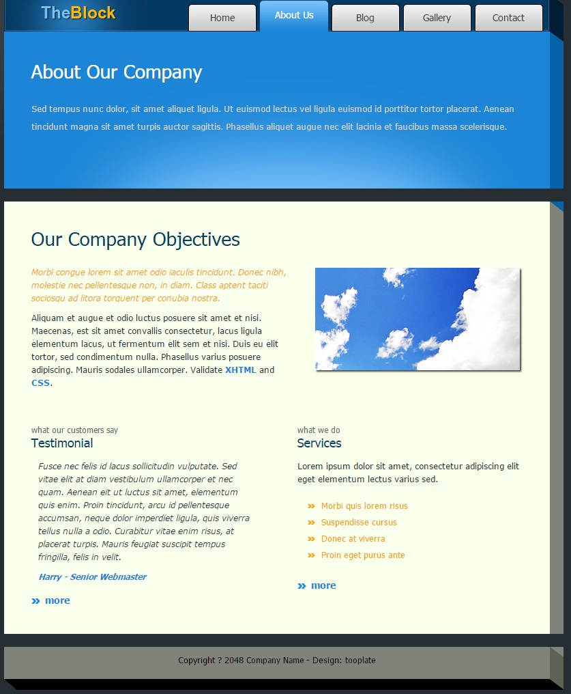
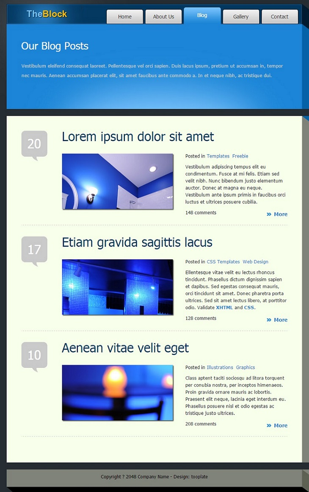
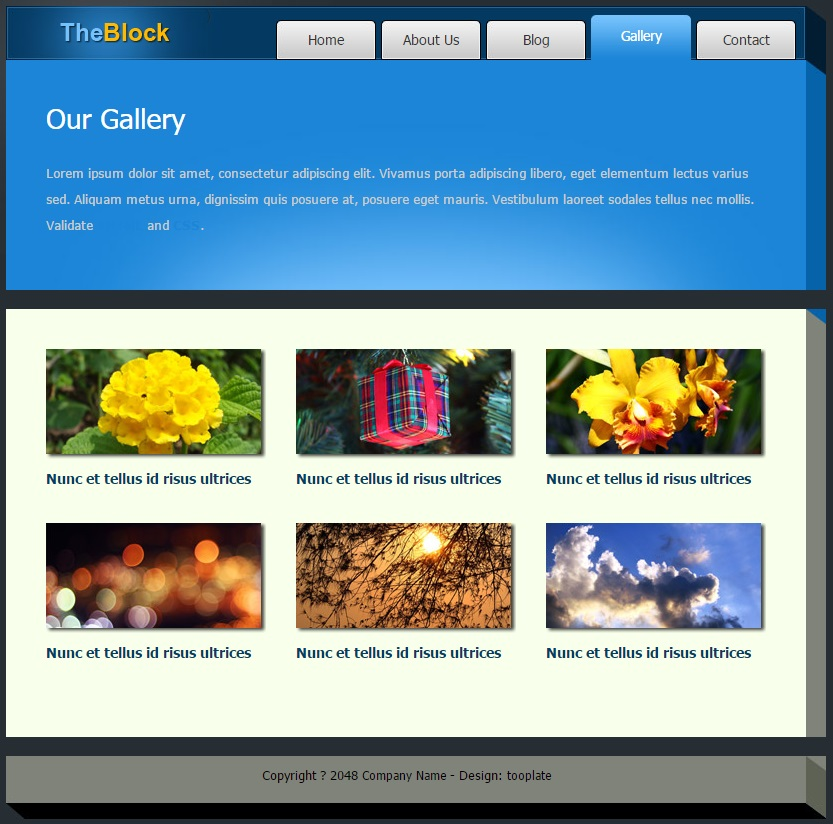
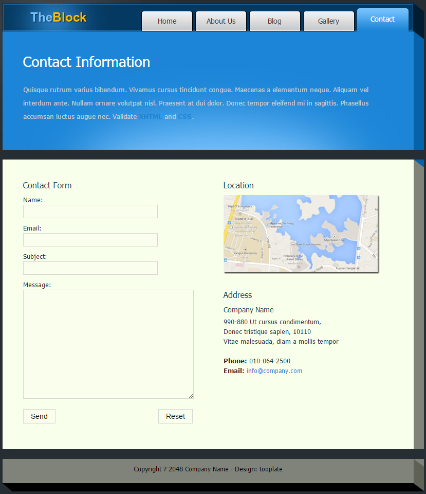

# Web界面快速开发实践

下面是一些常用的链接，供大家使用：

GIT地址：<https://git.oschina.net/tinyframework/tiny>

问题报告：<https://git.oschina.net/tinyframework/tiny/issues>

更多内容，请看本人博客，不一样的内容，一样的精彩！
 在展示过程的同时，会把相关的知识做一个充分的介绍 。

## 一、寻找网站模板

要做网站，不能没有模板，自己不会做网页设计，咋办？问谷歌找百度呗，找了一阵，看到下面这个模板不错，就它了。

<http://www.tooplate.com/zip_files/2042_the_block.zip>

相仔细了解这篇文章的同学，建议把原板的下载下来，对比着看，会更有感觉。

## 二、开工制作 

### 1.编写default.layout布局文件

位置：/default.layout

```
<!DOCTYPE html PUBLIC "-//W3C//DTD XHTML 1.0 Transitional//EN" "http://www.w3.org/TR/xhtml1/DTD/xhtml1-transitional.dtd">  
<html xmlns="http://www.w3.org/1999/xhtml">  
<head>  
    <meta http-equiv="Content-Type" content="text/html; charset=utf-8" />  
    <title>演示网站-${pageTitle}</title>  
    <meta name="keywords" content="" />  
    <meta name="description" content="" />  
    <script src="${TINY_CONTEXT_PATH}/uiengine.uijs"></script>  
    <link href="${TINY_CONTEXT_PATH}/uiengine.uicss" rel="stylesheet" />  
</head>  
<body>  
    ${pageContent}  
</body>  
</html>  
```

这个是标准布局了，直接贴过来，唯一要改的就是标题处加了“演示网站-”开头。  

里面引入的js和css是TinyUI引擎所独有的，主要处理JS,CSS顺序处理、合并、打包等相关，由于这个是框架内部实现的部分，这里只是使用就不展开来叙述了。

${pageContent} 这个标记了渲染替换的位置，一个layout文档中必须有且只能有一个(如果没有，你会发现不管怎么写页面，内容都是布局的内容；如果有多个，你会发现页面中的内容会加多次)。

### 2.编写UI组件定义文件

位置：/demosite.ui.xml

```
<ui-components>  
  
    <ui-component name="demosite" dependencies="">  
  
        <css-resource>/css/jquery.lightbox-0.5.css,/css/slider_style.css,/css/tooplate_style.css</css-resource>  
  
        <js-resource>/js/jquery.js,/js/jquery.lightbox-0.5.js,/js/swfobject.js</js-resource>  
  
    </ui-component>  
  
</ui-components>  
```
 

这里主要是定义用到的js和css，由于只是一个网站，就简单处理，只写一个了，实际应用当中，要根据用途和职能不同定义为许多个UI组件包。

### 3.编写通用宏定义

位置：/common.component

```
#macro a(title url)  
  
<a href="#link(url)">${title}</a>  
  
#end  
  
    
  
#macro img(url alt)  
  
  
  
#end  
  
    
  
#macro link(url)#if(url.startsWith("/"))${TINY_CONTEXT_PATH}#end${url}#end  
  
    
  
#macro pageTitle(title page)  
  
    #!set(pageTitle=title)  
  
    #!set(activePage=page)  
  
#end  
```

这面主要定义了4个宏，a是超连接的，img是图片的，link是把链接地址转换成绝对地址，pageTitle用于定义页面的标题和当前页是哪个页面的。

### 4.编写业务宏

位置：/demosite.component

```
#macro header()  
  
<div id="tooplate_header">  
  
    #bodyContent  
  
</div>  
  
#end  
  
    
  
#macro siteTitle(title))  
  
<div id="site_title"><h1><a href="#">${title}</a></h1></div>  
  
#end  
  
    
  
#macro menu()  
  
<div id="tooplate_menu">  
  
    <ul>  
  
        #bodyContent  
  
    </ul>  
  
</div>  
  
#end  
  
    
  
#macro menuItem(url title page)  
  
<li><a href="#link(url)"#if(activePage==page) class="current"#end >${title}</a></li>  
  
#end  
  
    
  
#macro tooplateWrapper())  
  
<div id="tooplate_wrapper">  
  
    #bodyContent  
  
</div>  
  
#end  
  
    
  
#macro tooplateMiddleSub()  
  
<div id="tooplate_middle_sub">  
  
    #bodyContent  
  
</div>  
  
#end  
  
    
  
#macro tooplateMiddle()  
  
<div id="tooplate_middle">  
  
    #bodyContent  
  
</div>  
  
#end  
  
    
  
    
  
#macro flashGridSlider()  
  
<div id="flash_grid_slider">  
  
    <a rel="nofollow" href="http://www.adobe.com/go/getflashplayer">  
  
          
  
    </a>  
  
</div>  
  
<script type="text/javascript">  
  
    var flashvars = {};  
  
    flashvars.xml_file = '#link("/photo_list.pagelet")';  
  
    var params = {};  
  
    params.wmode = "transparent";  
  
    var attributes = {};  
  
    attributes.id = "slider";  
  
    swfobject.embedSWF('#link(  
  
        "/flash_slider.swf")', "flash_grid_slider", "780", "210", "9.0.0", false, flashvars, params, attributes);  
  
</script>  
  
#end  
  
    
  
#macro tooplateContent())  
  
<div id="tooplate_content">  
  
    <span class="content_top"></span>  
  
    #bodyContent  
  
    <div class="cleaner"></div>  
  
</div>  
  
#end  
  
    
  
#macro tooplateFooter())  
  
<div id="tooplate_footer">  
  
    #bodyContent  
  
    <div class="cleaner"></div>  
  
</div>  
  
#end  
  
    
  
#macro box220(class)  
  
<div class="box_w220 ${class}">  
  
   #bodyContent  
  
</div>  
  
#end  
  
    
  
#macro box330(class)  
  
<div class="box_w330 ${class}">  
  
    #bodyContent  
  
</div>  
  
#end  
  
    
  
#macro gallery()  
  
<div id="gallery">  
  
    #bodyContent  
  
</div>  
  
#end  
  
    
  
#macro galleryBox(largeImage smallImage title alt info class)  
  
<div class="gallery_box ${class}">  
  
    <div class="gallery_img"><span></span>  
  
        <a href="#link(largeImage)" title="${title}">  
  
              
  
        </a>  
  
    </div>  
  
    <h6>${info}</h6>  
  
</div>  
  
#end  
  
    
  
#macro postBos(comment title imageUrl imageAlt postedInList commentCount)  
  
<div class="post_box">  
  
    <div class="comment"><a href="#">${comment}</a></div>  
  
    <h2>${title}</h2>  
  
    
  
    <div class="image_wrapper image_fl"><span></span>#img(imageUrl imageAlt)</div>  
  
    <p><span class="cat">Posted in  
  
     #for(postedIn in postedInList)  
  
        <a href="#">${postedIn}</a>  
  
     #end  
  
    </span></p>  
  
    #bodyContent  
  
    ${commentCount} comments <a class="more float_r" href="#">More</a>  
  
    <div class="cleaner"></div>  
  
</div>  
  
#end  

业务宏的定义，就是根据情况从美工制作的页面文件中抽取一些具有共性的内容，定义成一个宏，这样以后使用的时候，就只要使用有意义的宏而不是原来一堆一堆的Html标记。
5.定义演示网站布局文件

分析一下几个页面，都有页头，页脚，菜单，因此可以把这些共性的文件放在演示网站布局文件中： 

位置：/page/default.layout
[java] view plaincopyprint?在CODE上查看代码片派生到我的代码片
#@tooplateWrapper()  
  
    #@header()  
  
        #siteTitle("The Block")  
  
        #@menu()  
  
            #menuItem("index.page" "Home" "Home")  
  
            #menuItem("about.page" "About Us" "About")  
  
            #menuItem("blog.page" "Blog" "Blog")  
  
            #menuItem("gallery.page" "Gallery" "Gallery")  
  
            #menuItem("contact.page" "Contact" "Contact")  
  
        #end  
  
    #end  
  
    
  
    ${pageContent}  
  
    
  
    #@tooplateFooter()  
  
    Copyright © 2048 <a href="#">Company Name</a> - Design: <a href="http://www.tooplate.com">tooplate</a>  
  
    
  
    #end  
  
    
  
#end   
  
<script type="text/javascript">  
  
    $('#gallery a').lightBox();  
  
</script>  
  
<script type="text/javascript">  
  
    $('#map a').lightBox();  
  
</script>  
```

上面代码的函义是：
在整个页面中，上面放置Header，下面旋转Footer，中间放置内容

最后两段js，是说：对某指定选择器中的图片用lightbox去进行处理。

这里就把所有的通用的部分都抽取到布局文件中了。

### 6.定义相关页面

首页：
 
```
#pageTitle("Home" "Home")  
  
    
  
#@tooplateMiddle()  
  
  #flashGridSlider()  
  
#end  
  
    
  
#@tooplateContent()  
  
    
  
    <h2>Welcome To The Block!</h2>  
  
    
  
    <div class="image_wrapper image_fl"><span></span>  
  
        #img("/images/tooplate_image_01.jpg" "image")  
  
    </div>  
  
    <p><em>The Block is a <a rel="nofollow" href="http://www.tooplate.com">free website template</a> from <a  
  
            rel="nofollow" href="http://www.tooplate.com">Tooplate</a>. Credit goes to <a rel="nofollow"  
  
                                                                                          href="http://www.photovaco.com">Free  
  
        Photos</a> for photos used in this template.</em></p>  
  
    
  
    <p align="justify">Aliquam et augue et odio luctus posuere sit amet et nisi. Maecenas convallis, est sit amet  
  
        convallis consectetur, elementum lacus, ut fermentum elit sem. Duis eu elit tortor, sed condimentum nulla.  
  
        Phasellus varius posuere adipiscing. Mauris sodales dictum ullamcorper. Validate <a  
  
                href="http://validator.w3.org/check?uri=referer" rel="nofollow"><strong>XHTML</strong></a> and <a  
  
                href="http://jigsaw.w3.org/css-validator/check/referer" rel="nofollow"><strong>CSS</strong></a>.</p>  
  
    
  
    <div class="cleaner h40"></div>  
  
    #@box220()  
  
        <h4>pharetra id turpis<span>Lorem Ipsum Dolor</span></h4>  
  
    
  
        <p> Lorem ipsum dolor sit amet, consectetur adipiscing elit. Vivamus porta adi Piscing libero, eget elem  
  
            ntum lectus varius sed.</p>  
  
        <a href="#" class="more">more</a>  
  
    #end  
  
    #@box220()  
  
        <h4>semper nisl ac nibh<span>Donec Tincidunt Varius</span></h4>  
  
    
  
        <p>Pellentesque habitant morbi tristique senectus et netus et malesuada fames ac turpis egestas. Vestibulum  
  
            eu mauris id neque porttitor.</p>  
  
        <a href="#" class="more">more</a>  
  
    #end  
  
    #@box220("rmb")  
  
        <h4>consect adipiscing elit<span>Etiam Gravida Sagittis</span></h4>  
  
    
  
        <p>Cras eu egestas sem. Aenean mollis feugiat massa, eget pharetra nunc interdum non. Etiam euismod sem ac  
  
            sem tincidunt adipiscin.</p>  
  
        <a href="#" class="more">more</a>  
  
    #end  
  
#end  
```

由于这个里面的数据是具体写的，因此就没有再进行抽象，如果这些数据是从数据库来的，那可以再进行一下抽象，就可以用for循环直接搞定了。
关于：

```
#pageTitle("About" "About")  
  
    
  
    
  
#@tooplateMiddleSub()  
  
    <h2>About Our Company</h2>  
  
    <p>Sed tempus nunc dolor, sit amet aliquet ligula. Ut euismod lectus vel ligula euismod id porttitor tortor placerat. Aenean tincidunt magna sit amet turpis auctor sagittis. Phasellus aliquet augue nec elit lacinia et faucibus massa scelerisque.</p>  
  
#end  
  
    
  
#@tooplateContent()  
  
    <h2>Our Company Objectives</h2>  
  
<div class="image_wrapper image_fr"><span></span>  
  
        #img("/images/tooplate_image_01.jpg" "image")  
  
    </div>  
  
    <p><em>Morbi congue lorem sit amet odio iaculis tincidunt. Donec nibh, molestie nec pellentesque non, in diam. Class aptent taciti sociosqu ad litora torquent per conubia nostra.</em></p>  
  
    <p>Aliquam et augue et odio luctus posuere sit amet et nisi. Maecenas, est sit amet convallis consectetur, lacus ligula elementum lacus, ut fermentum elit sem et nisi. Duis eu elit tortor, sed condimentum nulla. Phasellus varius posuere adipiscing. Mauris sodales ullamcorper. Validate <a href="http://validator.w3.org/check?uri=referer" rel="nofollow"><strong>XHTML</strong></a> and <a href="http://jigsaw.w3.org/css-validator/check/referer" rel="nofollow"><strong>CSS</strong></a>.</p>  
  
    <div class="cleaner h40"></div>  
  
    #@box330("float_l")  
  
        <h4>what our customers say<span>Testimonial</span></h4>  
  
        <blockquote>  
  
        <p>Fusce nec felis id lacus sollicitudin vulputate. Sed vitae elit at diam vestibulum ullamcorper et nec quam. Aenean eit ut luctus sit amet, elementum quis enim. Proin tincidunt, arcu id pellentesque accumsan, neque dolor imperdiet ligula, quis viverra tellus nulla a odio. Curabitur vitae enim risus, at placerat turpis. Mauris feugiat suscipit tempus fringilla, felis in velit.</p>  
  
    
  
        <cite>Harry - <span>Senior Webmaster</span></cite>  
  
        </blockquote>  
  
        <a href="#" class="more">more</a>  
  
    #end  
  
    #@box330("float_r")  
  
        <h4>what we do<span>Services</span></h4>  
  
        <p> Lorem ipsum dolor sit amet, consectetur adipiscing elit eget elementum lectus varius sed.</p>  
  
        <ul class="tooplate_list">  
  
            <li>Morbi quis lorem risus</li>  
  
            <li>Suspendisse cursus</li>  
  
            <li>Donec at viverra</li>  
  
            <li>Proin eget purus ante</li>  
  
        </ul>  
  
        <a href="#" class="more">more</a>  
  
    #end  
  
#end  
```


日志：

```
#pageTitle("Blog" "Blog")  
  
    
  
    
  
#@tooplateMiddleSub()  
  
<h2>Our Blog Posts</h2>  
  
<p>Vestibulum eleifend consequat laoreet. Pellentesque vel orci sapien. Duis lacus ipsum, pretium ut accumsan in, tempor  
  
    nec mauris. Aenean accumsan placerat elit, sit amet faucibus ante commodo a. In et neque nibh, ac tristique  
  
    dui. </p>  
  
#end  
  
    
  
#@tooplateContent()  
  
    #@postBos("20" "Lorem ipsum dolor sit amet" "/images/tooplate_image_02.jpg" "Image 02" ["Templates","Freebie"] "148")  
  
    
  
        <p>Vestibulum adipiscing tempus elit eu condimentum. Fusce at mi felis. Etiam sed velit nibh. Nunc bibendum  
  
            justo elementum auctor. Donec at magna eu neque. Vestibulum ante ipsum primis in faucibus orci luctus et  
  
            ultrices posuere cubilia. </p>  
  
    #end  
  
    
  
    #@postBos("17" "Etiam gravida sagittis lacus" "/images/tooplate_image_03.jpg" "Image 03" ["CSS Templates","Web Design"] "128")  
  
    
  
    <p>Ellentesque vitae velit eu lectus rhoncus tincidunt. Phasellus dictum dignissim sapien et dapibus. Sed  
  
        egestas consequat mauris, orci tincidunt sit amet. Donec pharetra porta ultrices. Sed sit amet lectus  
  
        libero, at porttitor odio. Validate <a href="http://validator.w3.org/check?uri=referer"  
  
                                               rel="nofollow"><strong>XHTML</strong></a> and <a  
  
                href="http://jigsaw.w3.org/css-validator/check/referer" rel="nofollow"><strong>CSS</strong></a>.</p>  
  
    #end  
  
    
  
    #@postBos("10" "Aenean vitae velit eget" "/images/tooplate_image_04.jpg" "Image 04" ["Illustrations","Graphics"] "208")  
  
    
  
    <p>Class aptent taciti sociosqu ad litora torquent per conubia nostra, per inceptos himenaeos. Proin gravida  
  
        ornare mauris ac lobortis. Praesent elit neque, lacinia eget interdum eu. Phasellus posuere nisl et odio  
  
        egestas ac tristique justo ultrices. </p>  
  
    #end  
  
#end  
```

画廊：

```
#pageTitle("Gallery" "Gallery")  
  
    
  
#@tooplateMiddleSub()  
  
<h2>Our Gallery</h2>  
  
<p>Lorem ipsum dolor sit amet, consectetur adipiscing elit. Vivamus porta adipiscing libero, eget elementum lectus  
  
    varius sed. Aliquam metus urna, dignissim quis posuere at, posuere eget mauris. Vestibulum laoreet sodales tellus  
  
    nec mollis. Validate <a href="http://validator.w3.org/check?uri=referer" rel="nofollow"><strong>XHTML</strong></a>  
  
    and <a href="http://jigsaw.w3.org/css-validator/check/referer" rel="nofollow"><strong>CSS</strong></a>.</p>  
  
#end  
  
    
  
#@tooplateContent()  
  
    #@gallery()  
  
    #galleryBox("/images/gallery/image_01_l.jpg" "/images/gallery/image_01_s.jpg" "Nunc et tellus id risus ultrices" "Image 01" "Nunc et tellus id risus ultrices")  
  
    #galleryBox("/images/gallery/image_02_l.jpg" "/images/gallery/image_02_s.jpg" "Nunc et tellus id risus ultrices" "Image 02" "Nunc et tellus id risus ultrices")  
  
    #galleryBox("/images/gallery/image_03_l.jpg" "/images/gallery/image_03_s.jpg" "Nunc et tellus id risus ultrices" "Image 03" "Nunc et tellus id risus ultrices" "gb_rmb")  
  
    #galleryBox("/images/gallery/image_04_l.jpg" "/images/gallery/image_04_s.jpg" "Nunc et tellus id risus ultrices" "Image 04" "Nunc et tellus id risus ultrices")  
  
    #galleryBox("/images/gallery/image_05_l.jpg" "/images/gallery/image_05_s.jpg" "Nunc et tellus id risus ultrices" "Image 05" "Nunc et tellus id risus ultrices")  
  
    #galleryBox("/images/gallery/image_06_l.jpg" "/images/gallery/image_06_s.jpg" "Nunc et tellus id risus ultrices" "Image 06" "Nunc et tellus id risus ultrices" "gb_rmb")  
  
    #end  
  
#end  
```

## 三、运行
首页

 

关于



日志
 


画廊



联系我们
 


## 四、总结
上面的完整示例展现了采用Tiny框架开发页面的完整过程，下面总结一下需要说明的一些内容：

- 上面展示采用的模板引擎是TinyTemplate，当然也支持Velocity，但是推荐使用TinyTemplate，因为执行速度更快、功能更强、更容易使用
- 布局支持多重嵌套，上面的示例中有两层布局，根上的解决js、css引入，标题，网站图标等部分的内容，/page/目录中的解决网站的整体结构部分的内容，随着网站的复杂，可以做更多层的布局，使得很多页面共用的部分都放在布局文件中
- xxx.ui.xml定义了UI组件包的内容及其依赖关系，UI引擎会自动根据ui组件包的定义对js及css进行引入、整合、压缩。
- 整个页面只引入一个css和一个js文件，避免引入文件数太多导致的性能下降，同时提供了压缩，提升网络传输效率（这个例子中的文件都已压缩，因此压缩率不高）。
- page文件是用来编写展示内容的页面，在显示.page文件时，有两种方式，一种是.pagelet方式，一种是.page方式，区别在于用.page方式访问时，会渲染布局，而pagelet方式不会渲染布局，适合于Ajax方式使用。
- 整个网站在重构完成之后，没有一段内容是重复的，真正做到Tiny框架所说的DRY原则。
- 所有对上层布局文件的修改都会对所有下层页面产生影响，真正做到Tiny框架所说的下级服从上级原则。
- 越到底层的开发人员接触的越少，真正的页面编写文件，只需要从控制层转过来的数据再利用宏去显示内容即可，可以避免接触js,css,html等相关内容。(这一点在示例中还没有做到，毕竟示例是一个静态网站)，真正做到Tiny框架所说的减法原则，越到下面会的技能越少。
- 实际上框架也支持某个页面不服从上层布局的限制，但是我们不推荐这么做，因此这里没有展示这种用法。
采用Tiny框架制作前台，需要考虑好如下角色的协作：

- 美工：用于进行界面设计，页面切分
- UI组件包开发工程师：根据功能特性，把具有不同功能特性的js,css,image等放在一个jar包中 ，并编写对应的xxx.ui.xml文件，并设定好依赖关系，如果需要还需要编写公共的宏文件，用于方便别人使用，并隔离功能与具体的实现，使得后续的开发工程师尽量少的接触css,js。
- 业务组件开发工程师：根据功能特性，把页面中的一些比较业务化的，封装成业务组件，最终暴露的接口是一个名字及一些数据的输入，使得最终的界面开发工程师尽可能少的接触原生的html。
- 界面开发工程师：不关心界面展现的具体技术，利用UI组件包及业务组件开发工程师开发的组件，再加上控制层传过来的数据来编写最终的展现页面。

通过上面的分工，使得不同的开发人员关注于不同的技术细节，从而最大化的提升最终界面开发工程师的开发效率，同时因为有了一定的封装性，可以使得底层的变化不致于影响上层开发人员的工作成果。